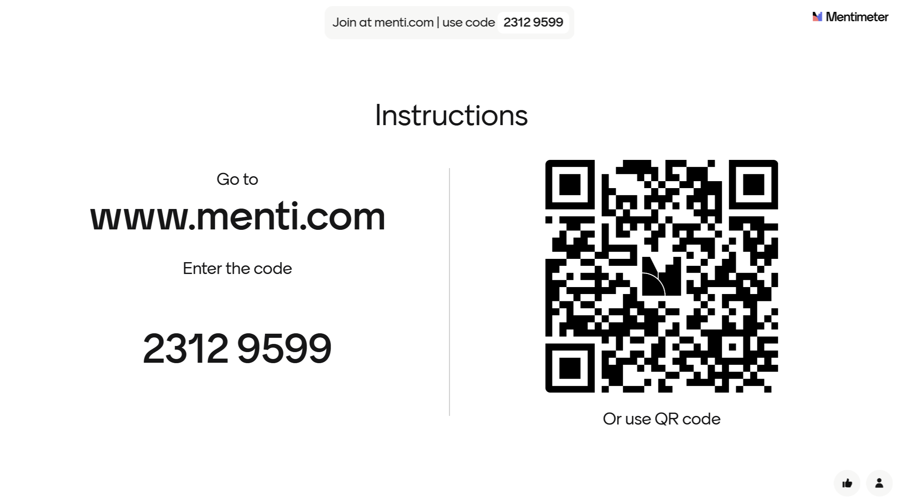

<!--

icon: https://raw.githubusercontent.com/soda-collections-objects-data-literacy/liascript-oers/refs/heads/main/resources/SODa-Logo_full.svg
link: https://raw.githubusercontent.com/soda-collections-objects-data-literacy/SODa_WissKI-ISWC25Bits/refs/heads/main/soda.css

-->

# SODa WissKI Bits 

**DATENMODELL ENTWICKELN UND IMPLEMENTIEREN AM BEISPIEL** 

Modul 2: **Vom Diagramm zu Pfaden – Erläutern und anwenden**

Einheit 1: **Ablauf und Warm-up**  

**Dauer:** ~ 15 Min.

---

## Begrüßung

> Dieses How-to-Tutorial *SODa WissKI Bits: Ontologiegestützte Modellierung von Forschungsdaten* bietet eine praxisorientierte Einführung in die Arbeit und Analyse mit strukturierten Forschungsdaten.  
>
> Im **Modul 2: *Datenmodell entwickeln und implementieren am Beispiel*** wird aus einem in *Draw.io* erstellten semantischen Modell eine *WissKI Pathbuilder*-Datei generiert.  
> Auf diese Weise wird eine konzeptionelle Ontologie in eine in WissKI nutzbare Graphstruktur überführt, die als Grundlage für die Arbeit und Analyse graphbasierten Forschungsdaten dient.  
>
> Das Modul ist als **How-to-Tutorial** konzipiert und führt nach dem Prinzip des *Learning by Doing* Schritt für Schritt in das praktische Arbeiten mit strukturierten, semantisch verknüpften Daten in WissKI ein.  
>
> In den **weiterführenden Einheiten** wird dieser anleitende Ansatz um **selbstgesteuerte Lernphasen** ergänzt,  
> in denen die Teilnehmenden ihr Wissen vertiefen, eigene Forschungsdaten modellieren und die erlernten Methoden auf ihre individuellen Forschungskontexte anwenden.

---

## Ablauf des Moduls

**Modul 2: 90 Min.**

| Einheit | Inhalt | Zeit |
|--------|--------|------|
| 1 | Willkommen & Warm-up | 15 Min. |
| 2 | Visualisierung eines Domänenontologie-Diagramms | 25 Min. |
| 3 | WissKI Pathbuilder-Datei erzeugen | 25 Min. |
| 4 | Weiterführende Modulthemen| 5 Min. |
| 5 | Austausch & Feedback | 15 Min. |

---

## Lernziele

Lernende können... 

* Draw.io zur Repräsentation der Domänenontologie unter Anleitung anwenden (LZ-ID 03\dataModeling_soda0001).
* CIDOC CRM zur Beschreibung eigener Resourcen anwenden (LZ-ID 03\dataModeling_soda0002)
* Attributwerte an vordefinierten Klassen benennen und anwenden (LZ-ID 03\dataModeling_soda0002).
* Domänenontologie-Diagramm als XML-Datei aus Draw.io exportieren (LZ-ID 03\dataModeling_soda0003).
* das Konvertierungstool "gnm_service: Draw.io diagrams to WissKI pathbuilders" nutzen (LZ-ID 03\dataModeling_soda0004).
* eine Pathbuilder-XML-Datei in WissKI importieren (LZ-ID 03\dataModeling_soda0005).
* Gruppen und Pfade im Pathbuilder überprüfen (LZ-ID 03\dataModeling_soda0006).

---

## Voraussetzung

Folgende Grundkenntnisse werden vorausgesetzt:

* WissKI und die Basisfunktionen sind grundlegend bekannt.
* Es gibt erst Erfahrung in der konzeptuellen Modellierung von Domänenontologien.
* Mit CIDOC CRM und Protegé wurde bereits gearbeitet.

Eine Einführung in diese Themen bietet Modul 1.

--- 

## Über das SODa-Projekt

Das **[SODa-Projekt](https://sammlungen.io/projekt)** fördert die Entwicklung nachhaltiger Forschungsdateninfrastrukturen, vermittelt und stärkt Datenkompetenz im Umgang mit universitären Sammlungen und Sammlungsdaten. 

Mehr als 1.200 wissenschaftliche Sammlungen in Deutschland bilden eine wesentliche Grundlage für:

- Forschung
- disziplinäre Weiterentwicklung
- akademische Lehre.

Damit diese Sammlungen und Daten langfristig nutzbar bleiben, benötigen diese **strukturierte und interoperable Daten und Datenmodelle**.  

Hier setzt **WissKI** mit seiner Ontologie- und Linked-Open-Data-Orientierung sowie der Gewährleistung der FAIR-Prinzipien an.

---

## Über das Team

Entwickelt wurde das Tutorial von:

  

Unterstützt hat **Ilias** mit einer Pipeline, mit der es möglich ist, Draw.io-Diagramme in XML-Pfade für den WissKI Pathbuilder zu konvertieren.

Damit wird es ermöglich, Domänenspezifische **Anwendungsprofile** automatisch zu generieren und gleichzeitig ontologische Konsistenz zu wahren.

---

## Erwartungsabfrage

Interaktive Mentimeter-Umfrage zur Erfassung von Erwartungen, Vorkenntnissen und bisherigen Erfahrungen mit WissKI und semantischer Datenmodellierung.

### Fragen 

* Was erwarten Sie von diesem Tutorial?
* Welche Datenkompetenzen bringen Sie mit?
* Welche Erfahrungen mit WissKI bringen Sie mit?
* Welche Erfahrungen haben Sie im Bereich semantische Datenmodellierung?
* Mit welchen Herausforderungen waren Sie bisher bei der Erstellung von Domänenontologien konfrontiert?

---

## Speed-Dating (Alternativ)

**Ziel:** 

* Aktivierung
* Austausch
* Vernetzung.

**Ablauf:**

1. Bitte stehen Sie alle auf.
2. Finden Sie eine Person, die Sie noch nicht kennen.
3. Interviewen Sie sich gegenseitig — je 30 Sekunden pro InterviewerIn.
4. Wechseln Sie nach jeder Runde die Partner:innen.

**Fragen:**

1. Wie heißen Sie und woher kommen Sie?
2. Welche Sprachen sprechen Sie?
3. Nennen Sie einen Fun Fact über sich.

**Beispiele für Fun Facts:**

- Sie haben versucht, Ihre Küche in OWL zu modellieren.
- Ihr Haustier heißt *SPARQL*.
- Sie sammeln japanischen Whisky oder Pokémon-Karten.

