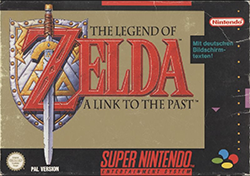
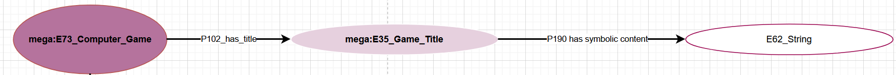
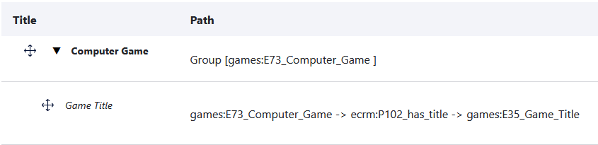
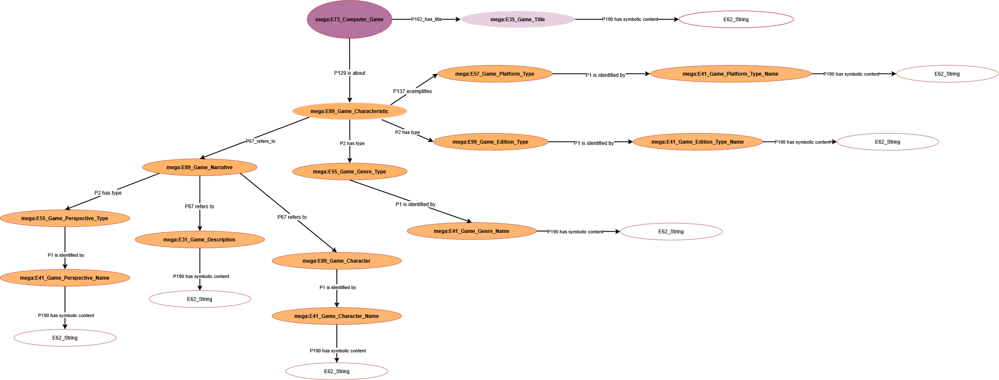

<!--

icon: https://raw.githubusercontent.com/soda-collections-objects-data-literacy/liascript-oers/refs/heads/main/resources/SODa-Logo_full.svg
link: https://raw.githubusercontent.com/soda-collections-objects-data-literacy/SODa_WissKI-ISWC25Bits/refs/heads/main/soda.css

-->

# SODa WissKI Bits 

**Modul 2: DATENMODELL ENTWICKELN UND IMPLEMENTIEREN AM BEISPIEL** 

Vom Diagramm zu Pfaden – Erläutern und anwenden

Einheit 2: **Visualisierung eines Domänenontologie-Diagramms**  

**Dauer:** ~ 25 Min.

---

## Warum Draw.io ?

**Visualisierungen** sind ein bedeutender Zwischenschritt und ein wesentliches Werkzeug, um **Modellierungsentscheidungen zu kommunizieren, auszuhandeln und ein gemeinsames Verständnis semantischer Strukturen zu fördern.**

Dieser Modellierungsschritt ist **nicht nur eine visuelle Übung** – das Diagramm bildet die **Voraussetzung für die (halb-)automatisierte Pipeline** zur Erstellung eines **Pathbuilders** in WissKI.

Das Draw.io-Diagramm wird dabei als **XML-Datei** exportiert und enthält bereits strukturierte Informationen zu **Klassen, Relationen und Gruppen**. Dadurch kann es **automatisiert weiterverarbeitet** und in **WissKI-Pathbuilder-Strukturen** überführt werden.

**Draw.io** unterstützt dabei...

* **Entitätsklassen und ihre Beziehungen** festzulegen,  
* **kollaborativ und transparent** gemeinsam zu modellieren,  
* die **Domänenontologie und ihre semantische Logik** sichtbar zu machen und zu diskutieren,  
* die **Ontologiestruktur vor der Implementierung in WissKI** zu prüfen und zu validieren,  
* und als **Reflexions- und Qualitätssicherungsinstrument** für semantische Entscheidungen zu dienen.

Besonders in kollaborativen Projekten erleichtert Draw.io die **Abstimmung zwischen Fachexpert*innen, Datenmodellierenden und Entwickler*innen**, da semantische Entscheidungen visuell nachvollziehbar und dokumentierbar bleiben.

---

## Ausgangspunkt

In Modul 1 wurde die konzeptionelle Grundlage des Beispiel-Datenmodells entwickelt:

* In **Einheit 5** wurden *zentralen Entitäten und Beziehungen* einer Beispiel-Domäne (Computerspiele) identifiziert.  
* In **Einheit 6** wurde die Top-Level Ontologie CIDOC CRM um *domänenspezifische Subklassen* erweitert.  

### Beispielobjekt

**Super Nintendo Entertainment System (SNES) Spiel: The Legend of Zelda**

| Darstellung | Beschreibung |
|------------|--------------|
| **Objekt** |  |
| **Semantische Annahme** | Titel des Objekts: *The Legend of Zelda: A Link to the Past* |
| **Draw.io Modell** |  |
| **WissKI Pathbuilder** |  |

### Auswahl und Festlegung von Kernentitäten 

**Beispiele für Spielmerkmale**

* Plattform (z. B. Nintendo 64, PlayStation, PC)
* Genre (z. B. Action-Adventure, RPG)
* Edition oder Version (z. B. Collector’s Edition, Remastered)

**Beispiele für narrative Elemente**

* Perspektive (z. B. First-Person, Third-Person)
* Spielbeschreibung
* Charaktere / Figuren

---

## Was wird visualisiert und modelliert?

Modelliert wird ein semantisches Modell in Draw.io als Grundlage für die Erstellung von Pfaden im WissKI Pathbuilder.
Hierfür werden die Kernentitäten und ihre Beziehungen der Beispieldomäne semantisch korrekt auf Basis des CIDOC CRM visualisiert.

**Beispielergebnisse**

<table>
  <tr>
    <td></td>
  </tr>
</table>

---

## Anforderungen an das Arbeiten mit Draw.io

* Es werden keine individuellen Instanzen abgebildet (nur Klassen/Typen).
* Es werden die domänenspezifischen Subklassen aus der bereits erstellten Domänenontologie verwendet.
* Die semantischen Relationen sind aus dem CIDOC CRM abzuleiten.
* Es sind vollständige Pfade zu erstellen.
* Dem zentralen Startknoten, jedem Gruppenknoten und jedem Endknoten werden jeweils **element_id**, **group_name** und **name** zugewiesen.  

---

## Aufgabe (Partnerarbeit – 20 Min.)

Das bereitgestellte Diagramm enthält gezielte Lücken (fehlende Knoten/Beziehungen), die zu ergänzen sind. Der Umfang und die Schwierigkeit variieren je nach Aufgabe (Anfänger/Experten).
Lücken sind durch geeignete Klassen und passende Properties zu schließen; temporäre Platzhalter (???) sind nach der Ergänzung zu entfernen.

* Die vorbereitete Draw.io-Datei runterladen (hier: https://github.com/soda-collections-objects-data-literacy/SODa_WissKI-ISWC25Bits  in "contentConcept/assets"; Für Anfänger "Gruppe_A.drawio.xml" und für Experten "Gruppe_E.drawio.xml")
* Die heruntergeladene Draw.io-Datei in Draw.io importieren (hier: https://app.diagrams.net/)
* Das Domänenontologie-Diagramm vervollständigen  

**Ressourcen**

* Für Anfänger: https://github.com/soda-collections-objects-data-literacy/SODa_WissKI-ISWC25Bits/blob/main/contentConcept/assets/Gruppe_A.drawio.xml
* Für Experten: https://github.com/soda-collections-objects-data-literacy/SODa_WissKI-ISWC25Bits/blob/main/contentConcept/assets/Gruppe_E.drawio.xml
* Domänenontologie: [http://games.m-e-g-a.org/game_domain.rdf](http://games.m-e-g-a.org/game_domain.rdf)
* Für semantische Beziehungen: PDF-Datei: [https://cidoc-crm.org/sites/default/files/cidoc_crm_version_7.1.3.pdf](https://cidoc-crm.org/sites/default/files/cidoc_crm_version_7.1.3.pdf) und HTML-Link: [https://cidoc-crm.org/html/cidoc_crm_v7.1.3.html](https://cidoc-crm.org/html/cidoc_crm_v7.1.3.html)

---

