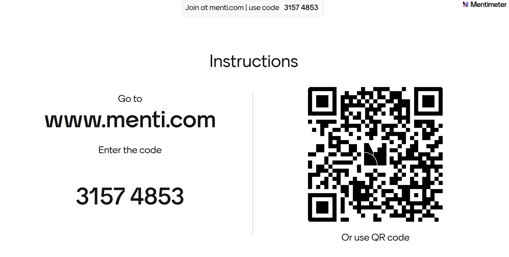

<!--

icon: https://raw.githubusercontent.com/soda-collections-objects-data-literacy/liascript-oers/refs/heads/main/resources/SODa-Logo_full.svg
link: https://raw.githubusercontent.com/soda-collections-objects-data-literacy/SODa_WissKI-ISWC25Bits/refs/heads/main/soda.css

-->

# SODa WissKI Bits 

**Modul 2: DATENMODELL ENTWICKELN UND IMPLEMENTIEREN AM BEISPIEL** 

Vom Diagramm zu den Pfaden – erklären und anwenden

Einheit 5: Abschluss und Feedback  

Dauer: ~ 15 Min.

---

## Kurzes Feedback

Euer Feedback ist wertvoll.

<table>
  <tr>
    <td></td>
  </tr>
</table>

---

## Offene Diskussionsimpulse

* Was hat gut funktioniert?  
* Was war herausfordernd?
* Was war der größte *Aha!*-Moment heute?  
* Was war hilfreich?
* Was ist auch im eigenen Projektkontext anwendbar?
* Wo bestehen noch Unsicherheiten?  
* Wie zuversichtlich fühlt ihr euch für die nächsten Schritte in der WissKI-Implementierung?

